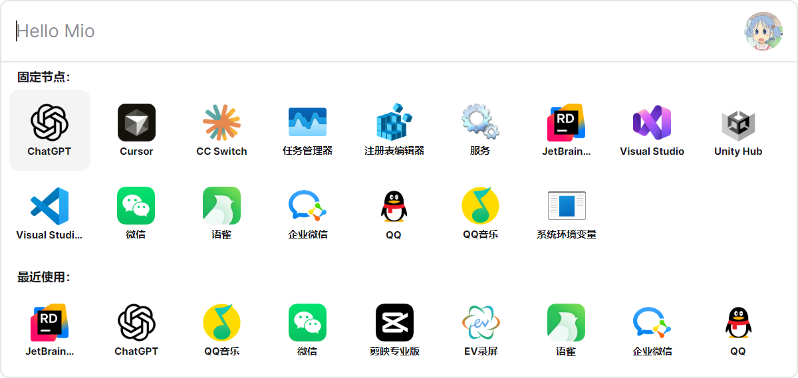

# MioKit

> Windows 上的效率工作台。

## 技术栈

MioKit 基于以下技术构建：

- [.NET 10](https://dotnet.microsoft.com/)
- [Avalonia UI](https://avaloniaui.net/)
- [Vue 3](https://vuejs.org/)
- [WebView2](https://developer.microsoft.com/microsoft-edge/webview2/)

常驻搜索入口使用 Avalonia 构建，配置页、管理页等需要快速迭代的界面使用 Vue 3 与 WebView2 构建。

## 下载 MioKit

  

## MioKit 是什么？

MioKit 是一个以全局搜索框为核心入口的 Windows 效率工作台。

按下 `Alt + Space` 呼出搜索框，输入几个字即可启动应用、搜索文件、执行系统操作，或调用插件提供的效率工具。MioKit 支持拼音、缩写和中英文混合搜索，也可以结合当前工作环境提供相关操作，数据默认保存在本机。

## 搜索框首页

搜索框首页集中展示固定节点和最近使用的功能，方便快速启动常用应用和操作。更多功能说明请阅读[功能介绍](docs/features.md)。

## 文档

本仓库提供 MioKit 的功能介绍、用户指南和插件开发文档。开发者可以从[插件开发指南](docs/developer/plugin-development.md)开始阅读。

插件安装方式请参考[用户指南中的插件章节](docs/user-guide.md#插件)。

- [功能介绍](docs/features.md)
- [文档总览](docs/README.md)
- [用户指南](docs/user-guide.md)
- [插件开发指南](docs/developer/plugin-development.md)
- [插件清单说明](docs/developer/plugin-manifest.md)
- [架构原则](docs/developer/architecture.md)
- [调试、打包与发布](docs/developer/debugging-and-packaging.md)
- [贡献指南](docs/contributing.md)

## 相关链接

- [MioKit 官网](https://www.tinyisle.cn/)
- [浏览 MioKit 插件](https://www.tinyisle.cn/plugins)
- [问题反馈](.github/ISSUE_TEMPLATE/bug_report.md)
- [功能建议](.github/ISSUE_TEMPLATE/feature_request.md)
- [贡献指南](docs/contributing.md)
