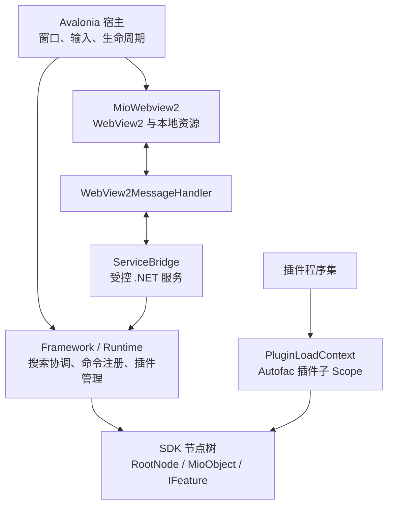

# 架构设计

> 状态：当前实现说明。本文描述 MioKit 当前的运行结构和主要扩展边界，帮助开发者理解宿主与插件如何协作；它不是稳定的插件 API 规范。具体接口、版本兼容性和发布承诺以 SDK 的正式发布说明为准。

MioKit 以可动态挂载的节点树为核心模型。搜索、命令、操作和插件都通过节点所实现的能力接口协作，而不是依赖某一个具体节点类型。Avalonia 提供原生桌面宿主；需要快速迭代的界面由 WebView2 承载 Web 前端，并通过受控桥接调用宿主服务。

## 架构总览

## 搜索、Command 与 Action

### 常规搜索

搜索框的输入由 `SearchBoxWindowViewModel` 交给 `SearchCoordinator`。协调器为每次请求创建带取消令牌的 `SearchRequest`，先依优先级执行预搜索管线，再并发调用树上所有 `ISearchableFeature` 并汇总结果。新的输入会取消旧请求，只有当前版本的结果才会回到界面并参与排序显示。

`/` 是搜索范围发现的前缀。框架注册的 `GroupSearchNode` 会在用户输入 `/` 时读取树上的 `ISearchScopeFeature`，展示可进入的范围，并阻止后续的常规搜索传播。进入附加面板后，搜索仅面向该面板及其后代的可搜索节点。

### Search Command

实现 `IAttachPanelFeature` 的节点可声明 `SearchCommands`，并可由 EAV 属性追加用户自定义别名。`SearchCommandRegistry` 监听节点的挂载、卸载和别名属性变化，将当前有效别名映射到附加面板；冲突时按先挂载的节点确定生效者。

用户输入命令前缀时，搜索框会显示补全建议。按下触发键后，搜索框按完整命令或最短前缀匹配解析面板、取消当前搜索，并调用面板的附加回调。实现 `IAttachPanelSearchFeature` 的面板还能接管附加状态下的搜索。

### 搜索结果操作

结果所属节点实现 `IResultActionProviderFeature` 时，搜索框会异步获取该结果可用的 `ISearchResultAction` 列表并显示为 Action。`SearchResultActionBase` 提供文字、图标、快捷键和异步命令的通用绑定外壳，具体操作由节点或插件实现。

未选择额外 Action 时，搜索结果的默认执行路径是检查所属节点是否具备 `IInvokeFeature`，并带着本次搜索上下文调用 `InvokeAsync`。因此，搜索发现、结果级 Action 和默认调用是彼此独立的能力，可以按需组合。

## 节点树与 Feature 解耦

`MioObject` 是节点基类，保存标识、属性和父子关系；`RootNode` 是全局根节点。节点通过 `SetParent` 挂载、重新挂载或从树上卸载：它维护父节点的子节点集合，并发布父级变更、子树挂载和子树卸载事件。

根节点处理这些子树事件，维护两类索引：节点 ID 到实例的缓存，以及 Feature 接口到节点实例的缓存。因此，`GetNodeById` 和 `GetFeatureInstances<TFeature>` 可直接命中索引，无需为每次搜索或界面刷新遍历整棵树。

`IFeature` 是附着在节点类型上的能力契约，例如 `ISearchableFeature`、`IInvokeFeature`、`IAttachPanelFeature` 和 `IResultActionProviderFeature`。`FeatureRegistry` 在程序集加载后扫描 `MioObject` 子类型及其实现的 Feature 接口，缓存双向映射；插件卸载前会移除其程序集对应的缓存。宿主因此只依赖能力接口，插件可以新增节点类型和能力组合而不修改宿主的分发逻辑。

源生成器进一步减少扩展样板：EAV 属性生成器根据属性声明生成属性访问代码；`PluginAccess` 生成器为标注的 partial 类生成从插件容器取得 `Plugin`、`PluginContext` 和日志器的访问成员。它们将重复的属性和插件访问代码集中到编译期生成，同时保留以接口协作的运行时边界。

## 插件如何进入运行时

`PluginManager` 负责插件的发现、校验和生命周期管理。加载批次先扫描插件目录与清单，校验宿主兼容性和依赖关系，并按依赖拓扑排序。每个插件随后在自己的 `PluginLoadContext` 中加载，以隔离可卸载的程序集及其依赖。

加载过程中，运行时会扫描并登记插件声明的 Mio/EAV 类型，定位唯一的 `IRegister` 实现，并创建 Autofac 插件子 Scope。注册器在该 Scope 中注册插件服务和按插件 ID 键控的 `IPlugin`；随后运行时解析插件实例并注入 `IPluginContext`。`PluginBase` 的初始化会准备插件数据，启动后将插件节点挂到 `RootNode`，由节点树事件自动让它的 Feature 参与搜索、命令和其他宿主能力。

停用、重载或退出时，插件先停止生命周期组件并从节点树卸载，再关闭其窗口与资源、清除 Feature/EAV 相关登记、释放子 Scope，最后卸载 `PluginLoadContext`。这一反向顺序避免已卸载插件仍残留在节点索引或服务容器中。

## Avalonia 与 WebView2 的协作

Avalonia 负责原生窗口、控件、输入、主题与应用生命周期。`MioWebview2` 作为 Avalonia 的原生控件宿主，创建和配置 WebView2 控制器，并为打包后的 Web 资源配置虚拟主机映射；开发环境可指向本地前端开发服务器。

页面初始化后，`MioWebview2` 创建 `WebView2MessageHandler` 监听和发送 Web 消息，再创建 `ServiceBridge`。桥接层只向 Web 前端注册允许访问的 .NET 服务：它负责消息序列化、方法调用、结果/错误返回，以及 .NET 事件和属性变化的转发。宿主侧的 UI 调度确保与 Avalonia 控件相关的操作回到正确线程。

释放 WebView2 时，桥接层会取消服务、事件和消息订阅，消息处理器会移除 WebView2 回调，控件再释放原生资源。Web 前端因此是宿主能力的受控消费者，而不是直接访问 Avalonia 或插件内部对象。
