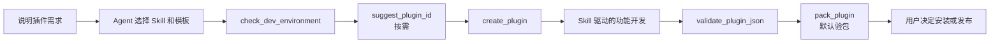

# 插件开发指南

MioKit 插件采用 **AI Agent 优先**的开发流程。开发者描述插件目标、界面和发布需求；Agent 读取 [MioKit.CodeAgent Skill](https://skills.sh/tiny-isle/MioKit.CodeAgent) 进行技术选型，并调用 [`@tiny-isle/miokit-mcp`](https://www.npmjs.com/package/@tiny-isle/miokit-mcp) 提供的 MCP 工具创建、校验、打包和验包。这样可使所有插件使用同一套模板和工程检查规则。

CodeAgent 是创建和工程校验的权威入口；本页说明工作流，不复制会随 SDK 演进的节点、生命周期和 UI API 细节。

## 1. 准备开发环境

- 安装 CodeAgent Skill：

  ```bash
  npx skills add https://github.com/tiny-isle/MioKit.CodeAgent
  ```

- 在 Agent 客户端中启用 `miokit-mcp`，使 Agent 可以调用 CodeAgent 的 MCP 工具。Skill 负责开发规范和技术选型，MCP 负责环境检查、工程操作和产物校验。
- 标准插件需要本机 .NET 10 SDK。
- WebView2 + Vue 插件还需要 Microsoft Edge WebView2 Runtime；缺少 `pnpm` 只会产生警告，但在构建前端资源时仍需补齐。

### MCP 安装与配置

MCP 服务需要 Node.js 20 或更高版本。它通过 stdio 与 Agent 客户端通信，不需要端口或 `cwd` 配置。

以 Cursor 为例，在项目的 `.cursor/mcp.json` 或用户级 MCP 配置中加入：

```json
{
  "mcpServers": {
    "miokit-mcp": {
      "command": "npx",
      "args": ["-y", "@tiny-isle/miokit-mcp@latest"]
    }
  }
}
```

保存后重启或重新加载 Agent 客户端。若需要固定版本，可将 `@latest` 替换为已验证的版本号，例如 `@0.0.2`。

MCP 提供的主要工具包括：

| 工具 | 用途 |
| --- | --- |
| `check_dev_environment` | 检查 .NET SDK，以及 WebView2 插件所需的 Runtime |
| `ensure_plugin_templates` | 准备 MioKit 官方插件模板 |
| `suggest_plugin_id` / `generate_guid` | 生成稳定的插件 ID 和 GUID |
| `create_plugin` | 创建标准插件或 WebView2 插件工程 |
| `validate_plugin_json` | 校验 `plugin.json` |
| `pack_plugin` / `inspect_plugin_nupkg` | 打包并检查 NuGet 插件包 |

MCP 只在本机执行开发环境检查、模板准备、文件创建和打包检查，不会自动上传 NuGet 包、提交插件市场或控制正在运行的 MioKit。请只在信任的 Agent 客户端和工作区中启用它。

## 2. Agent 路由与模板选择

Agent 根据工作区状态和 UI 需求选择 Skill：

| 场景 | Skill | Agent 的职责 |
| --- | --- | --- |
| 尚无 `plugin/plugin.json` 的新插件 | `miokit-plugin-new` | 选择模板并调用 MCP 创建解决方案 |
| 已有 `plugin/` 的核心开发 | `miokit-plugin-core` | 实现 SDK、节点、搜索、服务、清单和打包规则 |
| Avalonia / AXAML 界面 | `miokit-plugin-avalonia-ui` | 实现原生界面、主题、Dialog 和 Preview |
| WebView2 / Vue 界面 | `miokit-plugin-webview2` | 实现桥接、Vue 前端和前端产物打包 |

新项目默认选择 `miokit-plugin` 标准模板；只有需要 WebView2 + Vue UI 时才选择 `miokit-plugin-webview2`。已有插件项目不得重复初始化，而应直接进入对应的核心或 UI Skill。

## 3. 从需求到可交付插件



1. 向 Agent 提供插件名称、目标目录、功能需求；需要时说明组织名、显示名称、描述、作者和 WebView2 UI 需求。
2. Agent 先调用 `check_dev_environment`。标准模板检查 .NET 10 SDK；WebView2 模板还检查本机 Runtime。
3. 若尚未确定唯一标识，Agent 调用 `suggest_plugin_id` 生成 `com.<组织>.plugin.<短名>` 形式的候选值。
4. Agent 调用 `create_plugin` 创建解决方案。该工具会准备官方模板并执行 `dotnet new`，返回实际目录、模板和插件 ID。
5. 创建完成后，Agent 按需加载核心或 UI Skill 开发功能。SDK 细节、示例和反模式以 CodeAgent 中的对应 Skill 为准。
6. 修改 `plugin.json` 后，Agent 调用 `validate_plugin_json`。准备交付时调用 `pack_plugin`，它默认接着调用 `inspect_plugin_nupkg`。
7. 仅当验包报告没有 errors 时，产物才视为完成。包的安装、上传或市场提交由用户自行决定。

## 4. 强制约束

- 不手写或复制插件解决方案骨架。
- 不由 Agent 直接执行 `dotnet new`、`dotnet new install`，也不从本地目录安装模板；新项目统一调用 `create_plugin`。
- 不覆盖已存在 `plugin/plugin.json` 的项目。
- 不把“已打包”当作“已交付”：必须让 `inspect_plugin_nupkg` 通过，或使用默认开启验包的 `pack_plugin`。
- MCP 不会上传 NuGet、提交市场或控制运行中的 MioKit 宿主；这些外部操作由用户决定并完成。

## 相关文档

- [MioKit.CodeAgent](https://github.com/tiny-isle/MioKit.CodeAgent)
- [插件清单说明](plugin-manifest.md)
- [调试、打包与发布](debugging-and-packaging.md)
- [插件提交检查清单](checklist.md)
- [架构设计](architecture.md)
