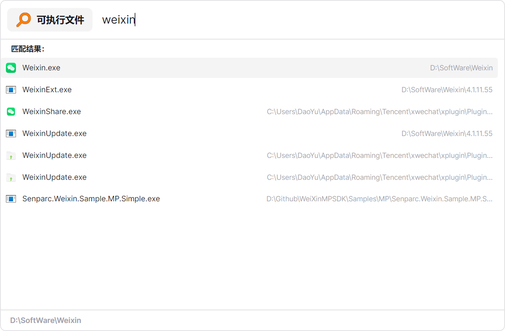

# 功能介绍

MioKit 是一个以全局搜索框为核心入口的 Windows 效率工作台。按下 `Alt + Space` 呼出搜索框，输入几个字即可启动应用、搜索文件、执行系统操作，或调用插件提供的效率工具。

## 全局搜索与快速执行

通过统一搜索框快速查找和执行：

- 桌面应用
- Microsoft Store 应用
- Windows 设置与控制面板项目
- 文件和文件夹
- 自定义启动项
- MioKit 插件提供的功能

## 上下文感知

MioKit 可以读取当前工作环境，并将其传递给相关操作：

- 当前前台窗口
- 当前剪贴板内容
- 当前资源管理器路径
- 当前选中的文件或文件夹

例如，可以在当前目录打开终端，或者直接使用剪贴板内容进行计算和处理。

## 拼音与模糊搜索

支持多种搜索方式：

- 中文拼音
- 首字母缩写
- 中英文混合输入
- 名称和别名匹配
- 搜索结果高亮

## 搜索结果管理

用户可以根据自己的使用习惯整理搜索结果：

- 固定常用项目
- 调整固定项目的顺序
- 根据最近使用记录提升常用项目
- 忽略不需要显示的项目

搜索结果可以直接执行，也可以通过结果菜单访问更多操作，例如打开所在目录、复制路径、管理固定状态或使用插件提供的自定义操作。


## 设置与个性化

MioKit 提供基础设置和个性化能力，用户可以调整主题模式、主题色，以及开机启动等系统行为。


## 快捷键

MioKit 支持全局快捷键和功能级快捷键：

- 使用全局热键呼出搜索框
- 为特定节点绑定快捷键
- 通过快捷键直接执行插件功能

## Command 搜索作用域

Command 用于将搜索框切换到特定的搜索作用域，而不是普通的命令执行器。

不同的插件或功能可以注册不同的 Command。用户输入 Command 的前缀时，MioKit 会提示可用的触发词；按下 `Tab` 后进入对应的搜索作用域，后续输入将使用该作用域自己的搜索逻辑。

例如，表达式计算功能可以提供 `calc` 和 `expression` 两种 Command：

```text
c → Tab → 12 * 8
```

输入 `c` 时可以提示 `calc`，按下 `Tab` 后进入表达式搜索作用域，之后的内容交给表达式计算功能处理。


Command 也可以用于区分同一个插件中的不同搜索类别。例如 Everything 插件可以通过不同的 Command 进入不同的文件搜索作用域，不同的作用域可以拥有不同的搜索范围、过滤规则和结果处理方式。

用户还可以根据自己的习惯，为支持 Command 的功能添加自定义触发词或别名。



## 插件扩展

插件可以接入 MioKit 的统一搜索框，为用户提供：

- 新的搜索结果
- 可执行的操作节点
- 搜索结果菜单
- Command 搜索作用域
- 自定义快捷键
- 搜索框附着式界面
- Avalonia 或 Vue 3 自定义界面

官网展示的插件方向包括快速输入、剪贴板、表达式计算、待办清单、终端指令、Everything 搜索、颜色转换、占用查找和文件快速选择等。


开发者可以从[插件开发指南](developer/plugin-development.md)开始阅读。

## 相关文档

- [用户指南](user-guide.md)
- [插件开发指南](developer/plugin-development.md)
- [插件清单说明](developer/plugin-manifest.md)

## 版本与兼容性

MioKit、Plugin SDK 和插件的版本兼容关系待补充，请以对应版本的正式文档为准。
