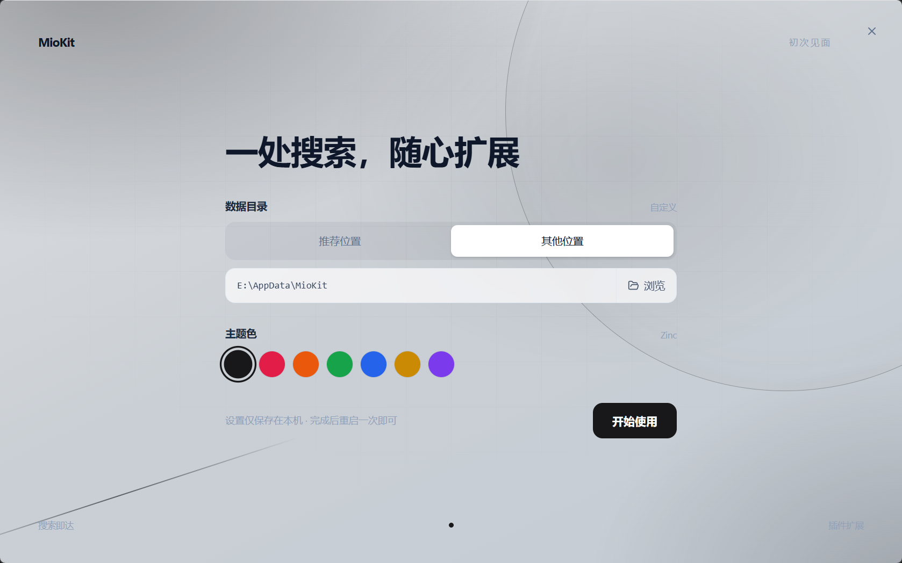
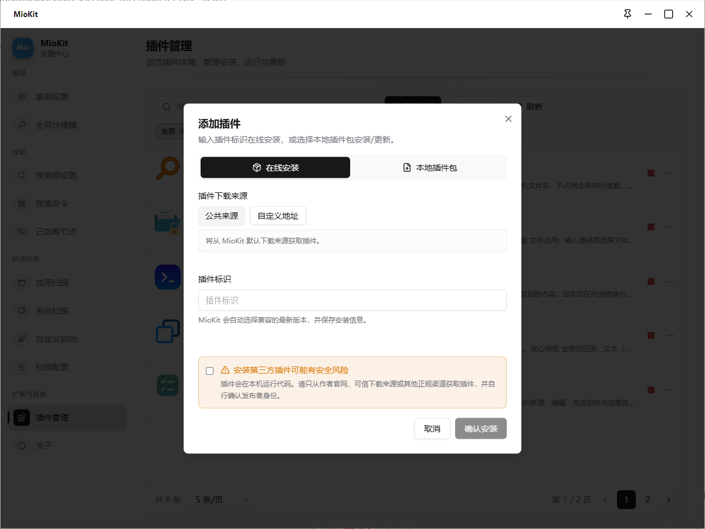
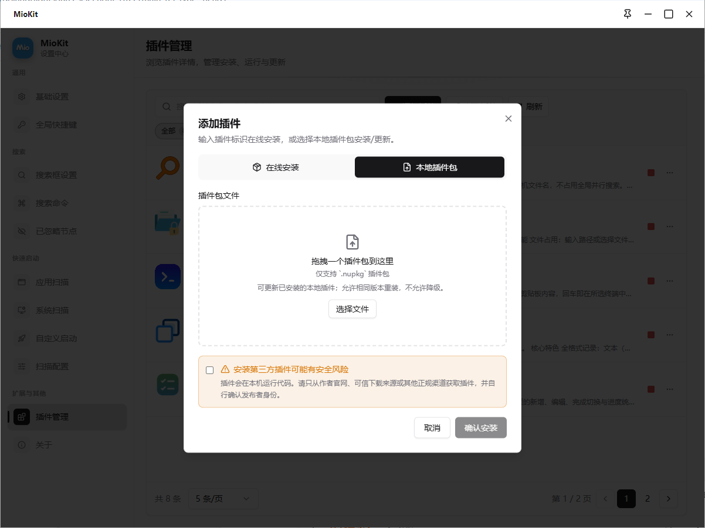

# 用户指南

本页面介绍如何安装 MioKit 并完成第一次使用。

## 安装

MioKit 可从 Microsoft Store 下载并安装：

[下载并安装 MioKit](https://apps.microsoft.com/detail/9n64fzj6nsk3)

打开链接后，点击 **获取** 或 **安装**，按照 Microsoft Store 的提示完成下载和安装。

## 首次启动

第一次启动 MioKit 时，需要完成基础设置：

1. 设置 MioKit 的数据目录。
2. 选择喜欢的主题。
3. 确认设置无误后，点击 **开始使用**。
4. 首次设置完成后，MioKit 即可正常使用。

安装完成后，可以按下 `Alt + Space` 呼出 MioKit 搜索框，开始搜索应用、文件和插件功能。

## 快速开始

1. 从 [Microsoft Store](https://apps.microsoft.com/detail/9n64fzj6nsk3) 下载并安装 MioKit。
2. 在首次启动页面设置数据目录和主题。
3. 点击 **开始使用** 完成初始化。
4. 按下 `Alt + Space` 打开搜索框。
5. 输入应用、文件或功能名称并执行。

## 数据目录与主题

数据目录和主题可以在首次启动时设置。具体的修改入口和迁移方式：待补充。

## 更新与卸载

更新和卸载方式遵循 Microsoft Store 的应用管理流程。具体版本兼容性和数据保留规则：待补充。

## 插件

### 官方插件

MioKit 作者提供的官方插件会发布在[官方插件页面](https://www.tinyisle.cn/plugins)。插件详情页会介绍功能、前置条件和 Package Id；安装时仍需回到 MioKit 的“插件管理”中完成。

下面以官方插件[快速输入](https://www.tinyisle.cn/plugins/quick-input)为例。它可以把常用文本、剪贴板内容和脚本变成可搜索的输入节点，官方页面给出的 Package Id 是 `MioKit.QuickInput`。

### 在线安装

1. 打开 MioKit 设置中心，进入 **插件管理**，点击 **添加插件**。
2. 在添加插件窗口中选择 **在线安装**。
3. 插件下载来源选择 **公共来源**。官方插件默认发布在这个来源中。

   

4. 在 **插件标识** 输入框中输入 `MioKit.QuickInput`。
5. 阅读安全提示，确认来源可信后勾选风险确认框，点击 **确认安装**。
6. 安装完成后按下 `Alt + Space`，搜索 **快速输入**，确认可以打开插件的管理界面或执行插件提供的功能。

如果插件发布在其他 NuGet 源，可以在第 3 步选择 **自定义地址**，填写插件源地址和插件标识，再按相同流程安装。请以插件作者提供的地址和 Package Id 为准。

### 从本地插件包安装

如果已经取得插件的 `.nupkg` 文件，可以直接从本地安装：

1. 打开 **设置中心 → 插件管理 → 添加插件**。
2. 切换到 **本地插件包**。
3. 将 `.nupkg` 文件拖入文件区域，或点击 **选择文件** 选取插件包。

   

4. 根据界面提示完成安装。已有同名插件时，可以更新或重新安装相同版本；本地安装不允许降级。

插件会在本机运行代码。无论使用公共来源、自定义 NuGet 源还是本地插件包，都请确认插件来源可信，并检查插件与当前 MioKit 版本的兼容性。

开发者可从[插件开发指南](developer/plugin-development.md)开始阅读。
